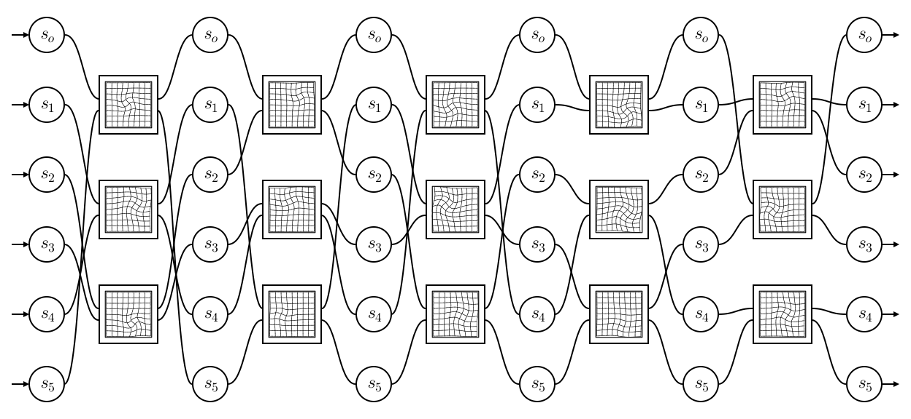
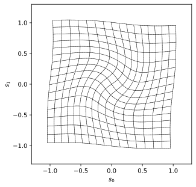
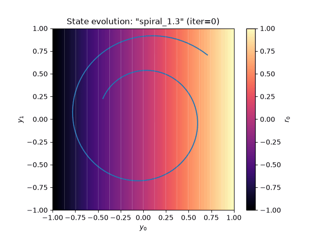
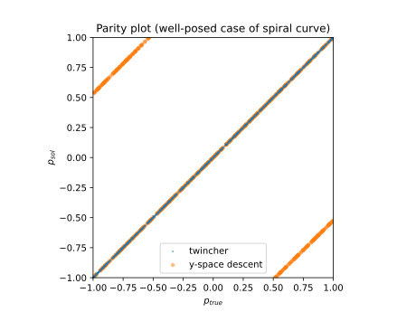
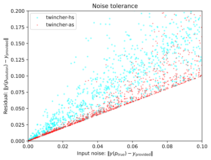
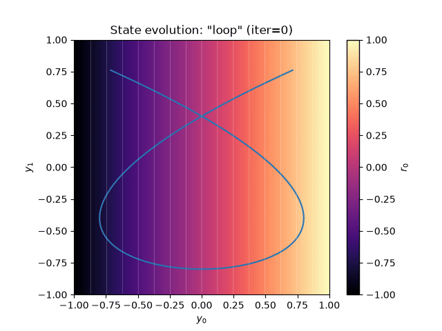
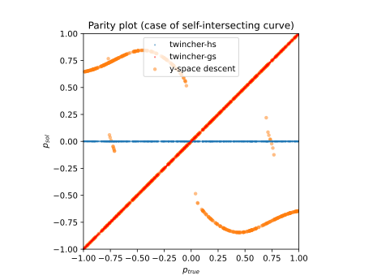
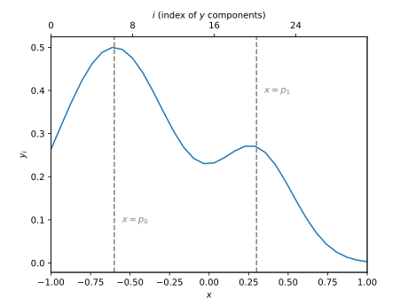
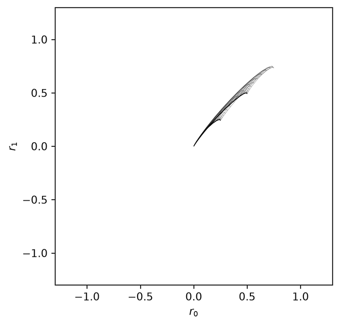
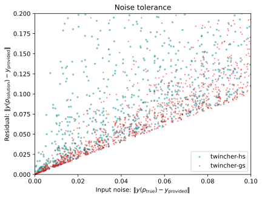

# Twincher

[](https://github.com/arkady-gonoskov/twincher/actions/workflows/tests.yml)
[](https://pypi.org/project/twincher/)
[](LICENSE)

Twincher is a class of ML systems for perception, action planning and other tasks that can be formulated as inverse problems. Instead of approximating intended solutions directly, twinchers are designed to find a representation space that can guide fast, never-stalling iterative approach to solutions, ensuring reaching needed accuracy, commonly within just a few iterations. Twinchers "learn" such representations via exploration of given forward processes, such as an image renderer, mathematical model, physics simulation or an ML model. Twinchers can deal with both well- and ill-posed inverse problems and can be made tolerant to noise in the incoming data. More broadly, twinchers provide trainable representation learning framework with inductive bias tailored to generalizing over continuous dependencies. This Python package provides an implementation of the twincher concept in the form of primitives for various problems and an example architecture named "hyper-sail".

- Reference: [A. Gonoskov, arXiv:2605.13470 (2026)](https://arxiv.org/abs/2605.13470)
- Website: [www.twincher.ai](https://www.twincher.ai)
- Get in touch: [contact@twincher.ai](mailto:contact@twincher.ai)

## Installation

Twincher requires Python 3.10 or newer and is installed with pip:

```bash
pip install twincher
```

The package is compiled during the installation, which requires a C++ compiler supporting C++17 (for example `g++`); CMake is installed automatically if needed. The primary platform is Linux (including WSL).

- **GPU support:** the GPU backend is compiled if the CUDA compiler `nvcc` is found during the installation, for example if the `bin` directory of the CUDA toolkit is in `PATH` (or `nvcc` is given by the environment variable `CUDACXX`). Otherwise twincher is installed for the CPU only. To use a GPU with `twincher.Learner`, PyTorch with CUDA support is needed as well.
- **Checking the installation:** `python -c "import twincher; twincher.info()"` prints, among other things, whether the CUDA backend was built and whether a GPU is available. If the CUDA toolkit is installed later, twincher can be rebuilt with `pip install --force-reinstall --no-deps --no-cache-dir twincher`.
- **CuPy (optional):** the computational core can also operate CuPy arrays (`pip install cupy-cuda13x`, matching your version of CUDA).

For development (editable installation, tests, build options) see [CONTRIBUTING.md](CONTRIBUTING.md).

## Getting started

Learning to find the position `p` along a spiral from the coordinates `y` of a point on it:

```python
import math
import numpy as np
import twincher

class Spiral:
    """Forward process y(p): position p on a spiral -> point y in the plane."""
    n_p, n_y, name = 1, 2, "spiral"
    def __call__(self, p, y):
        r = 1/(0.5*p[0] + 1.5)
        alpha = 0.25*math.pi + 1.3*math.pi*(p[0] + 1)
        y[0], y[1] = r*math.cos(alpha), r*math.sin(alpha)

stencil = Spiral()

# Learn a representation in which the inverse problem is solved by Gauss-Newton iteration
learner = twincher.Learner(arch="hs", n_s=16, n_l=64)
learner.generate_data(stencil=stencil, n_grid=128)
for _ in range(5001):
    learner.step()
learner.SH.save("spiral.twc")

# Solve the inverse problem y(p) = y_true for 1024 random points
solver = twincher.solver("spiral.twc", n_c=1024)
p_true = np.random.default_rng(0).uniform(-1, 1, size=(1024, 1))
y_true = np.empty((1024, 2))
for p, y in zip(p_true, y_true):
    stencil(p, y)
p_solution = np.empty((1024, 1))
solver.solve(stencil, y_true, n_iter=8, out=p_solution)
print("maximal error of p:", np.abs(p_solution - p_true).max())
```

Diagnostic outputs, such as the learning curve, are written to the directory `twincher_output`. The examples discussed below are available as scripts in [tutorial](tutorial/), see [tutorial/README.md](tutorial/README.md). The interfaces of the package are summarized in [Overview of interfaces](#overview-of-interfaces).

## Computation structure

Mathematically, a twincher is a parametrised diffeomorphism, i.e. a differentiable function whose inverse exists and is also differentiable. Our construction generally concerns the following transformation:
```math
T_a: s^{in} \rightarrow s^{out}
```
meaning that a twincher $`T_a`$ being dependent on a vector of trainable parameters $`a \in \mathbb{R}^{n_a}`$ transforms an input vector $`s^{in} \in \mathbb{R}^{n_s}`$ into an output vector $`s^{out} \in \mathbb{R}^{n_s}`$ (hereafter for a vector $`x`$, $`n_x`$ denotes its dimension).

Computationally, we consider a layered structure of pair-wise diffeomorphisms as exemplified in Fig. 1. To foster connectivity we use wiring based on round-robin scheduling. More generally, twinchers can have arbitrary number of layers, wiring between layers, heterogeneously use several types of pair-wise diffeomorphisms and have other modifications. 

<p align="center">
  <picture>
    <source media="(prefers-color-scheme: dark)" srcset="./assets/twincher-dark.svg">
    <source media="(prefers-color-scheme: light)" srcset="./assets/twincher-light.svg">
    
  </picture>
  <br>
  <em>Figure 1: The structure of Twincher exemplified with a minimalistic setting with n<sub>s</sub> = 6 and n<sub>l</sub> = 5 layers: components of s vector are shown by circles for each layer, while the pair-wise diffeomorphic transformations are shown with curved grid fragments.</em>
</p>

Each pair-wise diffeomorphism provides the effect of making a smooth localized twist over the input space, something that one can picture as "twisting" a "pinched" piece of fabric - the conflation of these words into "$`twinch`$" is used to refer to this foundational computational primitive in our construction. One case of such transformations has the form:

```math
\begin{gathered}
\begin{pmatrix}
s^{out}_0\\
s^{out}_1
\end{pmatrix}
=
\begin{pmatrix}
C & S\\
-S & C
\end{pmatrix}
\begin{pmatrix}
s^{in}_0 - c_0\\
s^{in}_1 - c_1
\end{pmatrix} + \begin{pmatrix}
c_0\\
c_1
\end{pmatrix},\\
C = \cos\alpha, \:\: S = \sin\alpha, \:\:
\alpha = t \exp\left(-\frac{(s^{in}_0 - c_0)^2 + (s^{in}_1 - c_1)^2}{w^2}\right),
\end{gathered}
```
with $`c_0`$ and $`c_1`$ denoting the center of the twist, while $`t`$ and $`w`$ its amplitude and width, respectively. Nevertheless, for computational efficiency on GPU we often replace exponent, sine and cosine functions:
```math
\begin{gathered}
C = \sqrt{1 - S^2}, \:\: S = g(3 - g^2)/2,\\
g = t\frac{w^4}{\left((s^{in}_0 - c_0)^2 + (s^{in}_1 - c_1)^2 + w^2\right)^2},
\end{gathered}
```
which results in the transformation illustrated in Fig. 2.

<p align="center">
  <picture>
    <source media="(prefers-color-scheme: dark)" srcset="./assets/twinch_0-dark.svg">
    <source media="(prefers-color-scheme: light)" srcset="./assets/twinch_0-light.svg">
    
  </picture>
  <br>
  <em>Figure 2: The structure of a twinch: the figure shows the grid spanning s<sup>in</sup> &isin; [-1, 1]<sup>2</sup> in the s<sup>out</sup> space.</em>
</p>

In our construction each twinch is parametrized with two coordinates setting the center of the twist, one parameter for its amplitude and one for its spatial spread - four parameters in total, which has been empirically observed to be sufficiently non-restrictive for constructing a broad range of well-behaving diffeomorphisms. 

The idea behind this construction is to provide parametrized non-linear redistribution of gradients among $`s`$ components with somewhat minimal generation of gradients, i.e. with an inductive bias that tends to achieve the desired local derivatives by localized rotation rather than stretching or compressing the dependency. In such a way we favor the entire twincher to "distill" informative signal (gradients) in $`s^{in}`$ and collect them into a non-collapsing subspace of $`s^{out}`$, which becomes a strategy for solving inverse problems, as detailed below.  

## Scalable routines for computing derivative tensors

The structural difference from neural networks leads to special computational routines. Furthermore, twinchers are intended to be optimized with respect to loss functions defined over derivative tensors (instead of true values/labels of any kind). This entails significant freedom for the output state values themselves and eventually plays a critical role in facilitating achieving needed differential-geometric properties. Fortunately computing the Jacobian matrix and its derivatives with respect to parameters can be made through just one forward and one backward pass, resulting in high scalability, essentially similar to that provided by error backpropagation for neural networks. Moreover, due to invertible structure we do not need to keep in memory the states of $`s`$ at the intermediate layers and instead can reproduce these values on-the-fly during backward pass. For clarity in what follows we omit explicit mentioning that computations are done for a batch of cases in parallel (either on CPU or GPU).

In the simplest case, our task is to compute first-order derivative tensor $`\partial s^{out}/ \partial s^{in}`$ and the derivative of the loss $`L`$ being a function of its components with respect to trainable parameters $`\partial L(\partial s^{out}/ \partial s^{in})/\partial a`$. Note that computing $`\partial^2 s^{out}/ \partial s^{in} \partial a`$ can be excessive because allocating (and updating over the backward pass) a matrix of size $`n_s \times n_s`$ for each batch element can entail significant unnecessary computational demands. 

It turns out practical to consider the propagation of gradients with respect to an arbitrary set of modes that define input derivative matrix: 
```math
    Q^0 = \frac{\partial s^0}{\partial p},
```
where the number of modes $`\dim(p) = n_p \leq n_s`$ and the superscript denotes the 0-th layer (input). To transition from $`j`$-th to the next layer during the forward pass we do:
1. For each relevant twinch we compute: $`s^j \rightarrow s^{j+1}`$ and $`\partial s^{j+1}/\partial s^j`$;
2. We use sparse computation to update matrix $`Q`$:
```math
Q^{j+1} = \frac{\partial s^{j+1}}{\partial s^j} Q^j.
```

This forward pass is referred to as *forward-query*, while the minimal computation $`s^j \rightarrow s^{j+1}`$ that results in $`s^{out}`$ only is referred to as *forward-inference*. In both cases the pass has $`O(n_c n_s n_l)`$ computational complexity and requires $`O(n_c n_s n_p)`$ memory, where $`n_c`$ is the number of cases in the batch (storing twincher parameters requires $`O(n_s n_l)`$ memory).  

One reason for making *forward-inference* pass is the computation of the derivative tensor for a subvector of $`r = s^{out}_{0:n_p}`$ with respect to inputs: 
```math
    V = V^0 = \frac{\partial r}{\partial s^0}
```
In this case, after obtaining $`s^{out}`$ using *forward-inference* pass we initiate:
```math
    V^{n_l} = \frac{\partial r}{\partial s^{n_l}} = I_{n_p, n_s},
```
with $`(I_{n_p, n_s})_{i, j} = \delta_{i, j}`$ being a matrix of size $`n_p \times n_s`$, and make a *backward-variance* pass composed for each layer of two operations (which also results in $`O(n_c n_s n_l)`$ computational complexity and $`O(n_c n_s n_p)`$ memory requirements):
1. For each relevant twinch we compute $`s^{j+1} \rightarrow s^j`$ and $`\partial s^j/\partial s^{j+1}`$;
2. We use sparse computations to update $`V`$:
```math
V^{j} = V^{j+1} \frac{\partial s^{j+1}}{\partial s^j}.
```

When it comes to computing the derivative $`\partial L/\partial a`$ it is again practical to consider a more general case of $`L`$ being a function of matrix $`u = \partial r /\partial p`$ with $`n_r, n_p \leq n_s`$.  In addition, we include the possible dependence of $`L`$ on $`s`$ at final and all inner layers, which is practical for enforcing all the $`s`$ components to stay within some predefined window that ensures the influence of twinches, for which we can restrict $`c_0, c_1 \in (-2, 2)`$. For our computations we define auxiliary tensors that are updated during the backward pass (as previously $`j = 0, ..., n_l`$ denotes the layer):
```math
A^j = \frac{\partial L}{\partial u} \frac{\partial^2 r}{\partial s^j \partial s^j} \frac{\partial s^j}{\partial p},\:\:
B^j = \frac{\partial L}{\partial u} \frac{\partial r}{\partial s^j}, \:\:
C^j = \frac{\partial s^j}{\partial p}, \:\:
b^j = \frac{\partial L}{\partial s^j}.
```
After making the *forward-query* pass we initiate:
```math
A^{n_l} = 0, \:\: B^{n_l} = \frac{\partial L}{\partial u}, \:\: C^{n_l} = Q^{n_l}, \:\: b^{n_l} = \frac{\partial L}{\partial s^{n_l}},
```
where $`B^{n_l}`$ and $`b^{n_l}`$ practically defines the loss for the case under consideration. Note that $`b^j`$ is also supplemented at each layer during the backward pass to penalize $`s`$ components exiting the window of interest. The auxiliary tensors are introduced so that they mutually support their layer-to-layer backward transformation together with computation of the loss derivatives. One can find that this leads to the following computational routine that we refer to as *backward-query* pass ($`a^j`$ refers to parameters of twinches at the $`j`$-th layer):
```math
\begin{aligned}
&\text{1. } \left.C^j\right. = \frac{\partial s^j}{\partial s^{j+1}} C^{j+1};\\
&\text{2. } \left.\frac{\partial L}{\partial a^j} \right|_\text{B-part} = B^{j+1} C^j \frac{\partial^2 s^{j+1}}{\partial s^j \partial a^j};\\
&\text{3. } \left.\frac{\partial L}{\partial a^j} \right|_\text{A-part} = A^{j+1} \frac{\partial s^{j+1}}{\partial a^j};\\
&\text{4. } \left.A^j\right. = A^{j+1}\frac{\partial s^{j+1}}{\partial s^j} + B^{j+1} \frac{\partial^2 s^{j+1}}{\partial s^j \partial s^j} C^j;\\
&\text{5. } \left.B^j\right. = \left(\frac{\partial s^{j+1}}{\partial s^j}\right)^{T} B^{j+1};\\
&\text{6. } \left.\frac{\partial L}{\partial a^j} \right|_\text{b-part} = b^{j+1} \frac{\partial s^{j+1}}{\partial a^j};\\
&\text{7. } \left.b^j\right. = b^{j+1} \frac{\partial s^{j+1}}{\partial s^j};\\
&\text{8. } \left.\frac{\partial L^\text{batch}}{\partial a^j}\right. = \sum_\text{batch} \left(\left.\frac{\partial L}{\partial a^j} \right|_\text{A-part} + \left.\frac{\partial L}{\partial a^j} \right|_\text{B-part} + \left.\frac{\partial L}{\partial a^j} \right|_\text{b-part}\right)
\end{aligned}
```
Here, A-part corresponds to the change of gradient flow due to the change of $`s^i`$ with $`i > j`$ sequentially, B-part corresponds to the change of incoming gradient and b-part corresponds to the dependency of loss on $`s^j`$ components. Despite sparsity of tensor operations this routine has $`O(n_c n_s n_l n_p)`$ computational complexity while still requiring $`O(n_c n_s n_p)`$ memory. 

Finally, we note that we use mapping of bounded parameters of twinches to the vector of parameters $`a`$ whose components are mathematically $`a_i \in (-\infty, \infty)`$, which practically provides improved utilization of memory for standard number representation, while naturally respecting the logical bounds for twinch parameters (here index of $`a`$ concern four consecutive elements that correspond to parameters of a single twinch):
```math
\begin{aligned}
&c_0 = \frac{2 a_0}{\sqrt{1 + a_0^2}} \in (-2, 2), \\
&c_1 = \frac{2 a_1}{\sqrt{1 + a_1^2}} \in (-2, 2), \\
&w = \frac{2 w_s + a_2^2(w_u + w_l) + a_2 \sqrt{a_2^2(w_u - w_l)^2 + 4(w_u - w_s)(w_s - w_l)}}{2(1 + a_2^2)} \in (w_l, w_u),\\
&t = \frac{0.9 a_3}{\sqrt{1 + a_3^2}} \in (-0.9, 0.9),
\end{aligned}
```
where hyper-parameters $`w_s`$, $`w_l`$ and $`w_u`$ control scale value, as well as lower and upper bound for $`w`$, respectively. Hereafter we use zero-based indexing for vector components.

## Trainable inverse solvers

Consider continuous forward process in the form of a callable function $`p \in [-1, 1]^{n_p} \rightarrow y(p) \in [-1, 1]^{n_y}`$ and the task of solving inverse problem: for a given $`y^\star`$ find $`p^\star`$ such that $`y(p^\star) = y^\star`$ (we generally assume $`n_y \geq n_p`$). More generally we can permit $`y^\star`$ to lie outside manifold $`y(p)`$ (for example due to noise in practical settings) and thus our task is to find:
```math
p^\star = \text{argmin}_p \|y(p) - y^\star\|.
```
Note that we first consider well-posed inverse problems, i.e. the problems that permit exactly one solution for $`\forall y^\star \in y([-1, 1]^{n_p})`$ (ill-posed problems are accessible for the `gs` architecture, see below).

Practically we want to *explore* the forward process in a way that makes it possible to find solutions within necessary accuracy using minimal number of calls of forward function, referred to as *stencil* in this context. For this purpose in this section we introduce a twincher-based architecture *hyper-sail* labeled `arch='hs'`.

Let us start by considering an idea of learning a representation of $`y = y(p)`$ by a function $`r=r(y)`$ that is injective with $`p \in [-1, 1]^{n_p}`$, such that for any given $`y^\star`$ we can converge to the solution using Gauss-Newton method in the space of $`r`$ vectors:
```math
\begin{aligned}
&p^{i+1} = p^i + \Delta p, \\
&\Delta p = \alpha J^+(r(y^\star) - r(y(p^i))), \\
&J = \left.\frac{\partial r}{\partial y} \frac{\partial y}{\partial p}\right|_{p=p_i},
\end{aligned}
```
where $`J^+=(J^T J)^{-1}J^T`$ denotes the Moore–Penrose pseudoinverse of $`J`$ and $`\alpha \in (0, 1]`$ is a scalar that can be used to restrict the step size to the expected region of validity for the linear approximation of $`r(p + \Delta p) = r(p) + \left(\partial r/\partial p\right)\Delta p`$ (practically we use adaptive clipped-step iteration). We also need to restrict $`p^{i+1} \in [-1, 1]^{n_p}`$, for example by clipping $`p`$ components. 

For inner points, preventing stalling in this iterative procedure would require avoiding rank-deficiency of $`J^+`$ and having $`r(y^\star) \neq r(y)`$ for $`\forall y \neq y^\star`$, i.e. until we reach the solution. The latter requirement is injectivity that is easier to achieve with the space of $`r`$ vectors being of higher dimensionality than $`n_p`$, but higher dimensionality may impose increased risks of $`J^+`$ collapsing. We therefore consider $`n_r = n_p`$. In this case we definitely need to bound $`\det J`$ away from zero, but this is not sufficient in case of limited space $`p \in [-1, 1]^{n_p}`$, because bijectiveness can be violated by self-crossing boundary. We practically prevent this possibility by also restricting velocity $`\partial r /\partial p`$, which leads to the following loss function for a twincher to learn the desired representation $`r(y)`$: 
```math
\begin{aligned}
& L_\text{hs} = L^\text{hs}_\text{det} + L^\text{hs}_\text{trim},\\ 
& L^\text{hs}_\text{det} = a_{\text{det}}\text{ReLU}\left(m_{\text{det}} - \det J \right)^2, \\
& L^\text{hs}_\text{trim} = a_{\text{trim}}\sum_{l < n_p}\text{ReLU}\left(\left\| \frac{\partial r}{\partial p_l}\right\| - v_{\text{trim}}\right)^2, 
\end{aligned}
```
where $`\text{ReLU}(\xi) = \max(0, \xi)`$, $`m_{\text{det}}`$ and $`a_{\text{det}}`$ are the margin for $`\det J`$ values and corresponding loss amplitude, whereas $`v_{\text{trim}}`$ and $`a_{\text{trim}}`$ are the threshold for penalizing high velocities and the corresponding amplitude of loss.

In addition, to make the solution robust to noise we can require that the variation of $`r`$ for any variation in $`y`$ outside the span of $`\partial y / \partial p`$ is small. For this we introduce an additional loss term 
```math
L_{\text{noise}}^{\text{hs}} \propto \left\|\frac{\partial r} {\partial y} \hat{Y}\right\|^2,
```
where the columns of an $`n_y \times (n_y - n_p)`$ matrix $`\hat{Y}`$ form a basis for the orthogonal complement of the column space of $`\partial y/ \partial p`$, i.e. $`\text{col}(\hat{Y}) = \text{col}(\partial y/\partial p)^\perp`$ (we here neglect the possible rank deficiency as it does not affect the final expression). Since in practical cases $`n_y`$ can be large, for training we use $`n_p`$ samples from $`\text{col}(\partial y/\partial p)^\perp`$ that are randomly generated for each iteration and each batch element, resulting in the loss:
```math
\begin{aligned}
&L_{\text{noise}}^{\text{hs}} = a_{\text{noise}}\sum_{k < n_p} \left\|\frac{\partial r} {\partial y} \hat{y}_k\right\|^2, \\
&\hat{y}_k = \text{normalize}\left(\left(I_{n_y, n_y} - \frac{\partial y}{\partial p}\left(\frac{\partial y}{\partial p}\right)^+\right) y_k \right), \\
&y_k \sim U\left([-1, 1]^{n_y}\right),
\end{aligned}
```
where $`\text{normalize}(\xi) = \xi / \|\xi\|`$.

The inductive bias of twinchers has been empirically observed to provide continuous nature of $`\det J`$, which makes it possible to effectively achieve the property of $`\det J > 0`$ using a limited sample of points and a sufficiently large margin $`m_{\text{det}}`$, i.e. exploiting the fact that $`\det J`$ is unlikely to cross zero in between the samples. However, experiments show another difficulty: in many cases the optimization is getting stuck in the state of self-crossing manifold $`r(y(p))`$. To overcome this difficulty we introduce curriculum in the form of training twincher for samples in a hypercube $`p \in [-R, R]^{n_p}`$, gradually expanding the range $`R`$ whenever $`\det J \geq m_{\text{clearance}}`$ is observed for some large enough number of samples within the current hypercube. One can picture this as expanding a bubble of $`\det J > 0`$ in $`\mathbb{R}^{n_p}`$ that pushes all regions of $`\det J < 0`$ away and in such a way eventually flattens out the manifold $`r(y(p))`$ in $`[-1, 1]^{n_p}`$, which has inspired the name *hyper-sail* for this architecture.   

Let us now outline the training process. We initiate a twincher with $`n_s \geq n_y`$ and preallocate computational entity named `Shuttle` for batch computations with $`n_p = \dim(p)`$. We then set $`R = R_{\text{step}}`$ and perform the following routine at each iteration: 

1. Sample a batch of $`n_c`$ cases and use stencil $`y(p)`$ to compute or estimate (using differentiable capabilities of the stencil, finite differences and/or interpolation of collected data):
```math
p_i \sim U\left([-R, R]^{n_p}\right), \:\:
y_i = y(p_i), \:\:
\left(\frac{\partial y}{\partial p}\right)_i = \left.\frac{\partial y}{\partial p}\right|_{p = p_i}.
```

2. Assign inputs and perform a forward-query pass (hereafter we omit batch index $`i`$ and imply that for all relevant tensors' indices beyond $`n_y`$ zero values are assigned):
```math
\begin{aligned}
&s = y, \:\: Q = \frac{\partial y}{\partial p}, \\
& s, Q \xrightarrow{} (\text{forward-query}) \xrightarrow{} s, Q. 
\end{aligned}
```

3. Assign tensors $`b`$, $`B`$ and perform backward-query pass:
```math
\begin{aligned}
& b = 0, \\
& B_{\text{det}} = -2 a_{\text{det}} \text{ReLU}\left(m_{\text{det}} - \det Q\right) \det(Q) Q^{-T},\\
& \left(B_{\text{trim}}\right)_{k, l} = 2 a_{\text{trim}} \text{ReLU}\left(\left\|Q_{:, l}\right\| - v_{\text{trim}}\right)\left\|Q_{:, l}\right\|^{-1} Q_{k, l},\\
& B = B_{\text{det}} + B_{\text{trim}},\\
& s, b, B \xrightarrow{} (\text{backward-query}) \xrightarrow{} \frac{\partial L_\text{hs}}{\partial a}.
\end{aligned}
```

4. Randomly generate unit vectors in subspace $`(\partial y /\partial p)^\perp`$ for enhancing tolerance to noise:
```math
\begin{aligned}
&y_k \sim U\left([-1, 1]^{n_y}\right),\\
&\hat{y}_k = \text{normalize}\left(y_k - \frac{\partial y}{\partial p}\left(\left(\frac{\partial y}{\partial p}\right)^+ y_k\right) \right). 
\end{aligned}
```

5. Assign inputs and perform a forward-query pass:
```math
\begin{aligned}
&s = y, \:\: Q = \left[\hat{y}_0, ..., \hat{y}_{n_p - 1}\right], \\
& s, Q \xrightarrow{} (\text{forward-query}) \xrightarrow{} s, Q. 
\end{aligned}
```

6. Assign tensors $`b`$, $`B`$ and perform backward-query pass:
```math
\begin{aligned}
& b = 0, \\
& B = 2 a_\text{noise} Q,\\
& s, b, B \xrightarrow{} (\text{backward-query}) \xrightarrow{} \frac{\partial L^\text{hs}_\text{noise}}{\partial a}.
\end{aligned}
```

7. Combine the loss gradients from all terms and use the optimizer of choice to update the twincher parameters:
```math
\begin{aligned}
&\frac{\partial L}{\partial a} = \frac{\partial L_\text{hs}}{\partial a} + \frac{\partial L^\text{hs}_\text{noise}}{\partial a},\\
&a: = \text{Optimizer}\left(a, \frac{\partial L}{\partial a}\right).
\end{aligned}
```
8. In case step 3 indicated that all $`\det Q \geq m_\text{clearance}`$ (or this holds for a number of last iterations) increase $`R`$:
```math
R := \min(1, R + R_\text{step}).
```

Note that the outlined routine represents a minimal version, which is extended with several straightforward modifications that are omitted here for clarity (see documentation and source code).

## Elemental examples

### Spiral (well-posed inverse problem)

As the most elemental example we consider a problem of finding location along a spiral on a 2D plane defined by a stencil $`y=y(p)`$ (following convention, the coordinate along the spiral varies in $`p_0 \in [-1, 1]`$):
```math
\begin{aligned}
&r = \left(p_0/2 + 3/2\right)^{-1},\\
&\alpha = \frac{\pi}{4} + 1.3 \pi (p_0 + 1),\\
&y_0 = r \cos \alpha, \:\: y_1 = r \sin \alpha.
\end{aligned}
```
In Fig. 3 we show the spiral on $`y_0`$-$`y_1`$ plane together with the evolution of representation $`r_0`$ throughout the outlined optimization process. As one can see the problem is well-posed. In the vicinity of spiral the learned $`r_0`$ continuously varies with $`p_0`$ making possible finding solutions by reducing $`\|r(p) - r(p_\text{true})\|`$, which corresponds to a reduced form of Gauss-Newton descent in this case.

<p align="center">
  <picture>
    <source media="(prefers-color-scheme: dark)" srcset="./assets/spiral_1.3-dark.gif">
    <source media="(prefers-color-scheme: light)" srcset="./assets/spiral_1.3-light.gif">
    
  </picture>
  <br>
  <em>Figure 3: Evolution of r<sub>0</sub>(y<sub>0</sub>, y<sub>1</sub>) throughout the optimization process for the case of well-posed problem of finding the position p<sub>0</sub> along a spiral from coordinates (y<sub>0</sub>, y<sub>1</sub>).</em>
</p>

In Fig. 4 one can see that this results in accurate solution of the inverse problem across $`p_0 \in [-1, 1]`$. One can also see that Gauss-Newton optimization in $`y`$ space results in getting stuck at local minima for the points near the ends of the spiral curve.

<p align="center">
  <picture>
    <source media="(prefers-color-scheme: dark)" srcset="./assets/spiral_parity_plot-dark.svg">
    <source media="(prefers-color-scheme: light)" srcset="./assets/spiral_parity_plot-light.svg">
    
  </picture>
  <br>
  <em>Figure 4: Solutions based on Gauss-Newton method in learned space r<sub>0</sub> as well as in output space y shown as a function of true value p<sub>true</sub>.</em>
</p>

In Fig. 5 we show to what extent the solutions are tolerant to noise in $`y`$. For this we generate points $`y_\text{provided}`$ in $`y`$ plane with varied deviation $`\|y(p_\text{true}) - y_\text{provided}\|`$ from the spiral curve and show how close the obtained solutions $`y(p_\text{sol})`$ are to these points, which we quantify by residual $`\|y(p_\text{sol}) - y_\text{provided}\|`$. One can observe that the residual in $`y`$ systematically tends to zero with decreasing amplitude of deviations, meaning that the twincher-based solution routine itself does not introduce any visible error. Further training with $`L^\text{hs}_\text{noise}`$ tends to reduce the deviations from the diagonal (the best possible outcome). Fig. 5 also shows the result for `as` twincher architecture obtained within the same number of iterations.

<p align="center">
  <picture>
    <source media="(prefers-color-scheme: dark)" srcset="./assets/spiral_noise_tol-dark.svg">
    <source media="(prefers-color-scheme: light)" srcset="./assets/spiral_noise_tol-light.svg">
    
  </picture>
  <br>
  <em>Figure 5: Tolerance to noise deviations in y for </em>'hs'<em> and </em>'as'<em> twincher architectures (same number of iterations).</em>
</p>

### Self-crossing loop (ill-posed inverse problem)

Let us now consider an elemental case of ill-posed problem in the form of finding a position along a self-crossing loop:
```math
\begin{aligned}
&y_0 = -0.8 \sin \left(1.35 \pi p_0\right),\\
&y_1 = -0.8 \cos \left(0.9 \pi p_0\right).
\end{aligned}
```
In this case the presence of a crossing point in $`y`$ that corresponds to two distinct points in $`p_0`$ makes it impossible to find the representation that fulfills the requirement of globally guiding to the solution of inverse problem prescribed by the `hs` architecture. Indeed, in Fig. 6 one can see that once $`R`$ becomes large enough further progress becomes impossible and no useful representation is found in the end.  

<p align="center">
  <picture>
    <source media="(prefers-color-scheme: dark)" srcset="./assets/loop_hs-dark.gif">
    <source media="(prefers-color-scheme: light)" srcset="./assets/loop_hs-light.gif">
    
  </picture>
  <br>
  <em>Figure 6: Evolution of r<sub>0</sub>(y<sub>0</sub>, y<sub>1</sub>) throughout the optimization process for the case of ill-posed problem of finding the position p<sub>0</sub> along a self-crossing loop from coordinates (y<sub>0</sub>, y<sub>1</sub>).</em>
</p>

However, the solution of ill-posed problems is possible based on `gs` twincher architecture, which is demonstrated with the parity plot shown in Fig. 7.

<p align="center">
  <picture>
    <source media="(prefers-color-scheme: dark)" srcset="./assets/loop_parity_plot-dark.svg">
    <source media="(prefers-color-scheme: light)" srcset="./assets/loop_parity_plot-light.svg">
    
  </picture>
  <br>
  <em>Figure 7: Solutions of ill-posed problem of finding position along a self-crossing loop based on Gauss-Newton descent in y-space, failed attempt with </em>'hs'<em> architecture, as well as with help of </em>'gs'<em> architecture capable of dealing with ill-posed problems.</em>
</p>

### Double-Gaussian: noisy data interpretation in terms of given model

For a slightly less elemental example we consider the problem of finding locations of two Gaussian peaks such that their sum is closest to the given distribution provided with a set of grid values. For this problem we consider a stencil, labeled as "double-gaussian":
```math
\begin{aligned}
&y_i = \frac{1}{2}e^{-4(x_i - p_0)^2} + \frac{1}{4}e^{-9(x_i - p_1)^2},\\
&x_i = -1 + 2i/(n_y - 1),
\end{aligned}
```
with $`n_p = 2`$ and $`n_y = 32`$. An example of distribution without noise is shown in Fig. 8.
<p align="center">
  <picture>
    <source media="(prefers-color-scheme: dark)" srcset="./assets/double_gaussian-dark.svg">
    <source media="(prefers-color-scheme: light)" srcset="./assets/double_gaussian-light.svg">
    
  </picture>
  <br>
  <em>Figure 8: An example of distribution that illustrates the "double-gaussian" stencil.</em>
</p>

Fig. 9 shows the grid that spans values of $`p \in [-1, 1]^2`$ in the $`r`$ space throughout the optimization process for an `hs` twincher with $`n_s = 2 n_y`$ and $`n_l = 64`$. One can see that the grid is getting unraveled and flattened out so that $`r`$ becomes bijective with $`p`$. In this case the optimization took 13000 iterations.    

<p align="center">
  <picture>
    <source media="(prefers-color-scheme: dark)" srcset="./assets/double_gaussian-dark.gif">
    <source media="(prefers-color-scheme: light)" srcset="./assets/double_gaussian-light.gif">
    
  </picture>
  <br>
  <em>Figure 9: The grid spanning p &isin; [-1, 1]<sup>2</sup> shown in r space throughout the optimization within 13000 steps.</em>
</p>

Fig. 10 shows the tolerance to noise in $`y`$ for `hs` and `gs` architectures under the same number of optimization steps.  

<p align="center">
  <picture>
    <source media="(prefers-color-scheme: dark)" srcset="./assets/double_gaussian_noise_tol-dark.svg">
    <source media="(prefers-color-scheme: light)" srcset="./assets/double_gaussian_noise_tol-light.svg">
    
  </picture>
  <br>
  <em>Figure 10: Tolerance to noise deviations in y for </em>'hs'<em> and </em>'gs'<em> twincher architectures (same number of optimization steps) for the 'double-gaussian' problem.</em>
</p>

## Architectures

Twinchers can be used in many ways, which we refer to as twincher architectures. Apart from `hs` twincher architectures include (request via [contact@twincher.ai](mailto:contact@twincher.ai)):

- `as` is designed for well-posed problems. As compared to `hs`, it avoids having $`n_p`$ factor in computational complexity providing much more scalable approach for complex tasks. In addition, under similar conditions it shows much faster learning capabilities as well as better abilities to enhance noise tolerance.

- `gs` is designed for ill-posed problems. Just like `as`, it avoids having $`n_p`$ factor in computational complexity. It has similar to `as` abilities to enhance noise tolerance, but overall can be slower than `as` when dealing with the same well-posed problem.

- `ha` provides a scalable paradigm for Physical AI systems.

## Overview of interfaces

With respect to package interfaces there are two levels.

### Computational core

Computational core is written in C++/CUDA and is delivered to Python via Pybind11. The use is based on the class `Shuttle` that handles forward and backward passes for a batch of cases using either CPU or GPU. Initialization of a `Shuttle` instance takes the following parameters:
- `data_type` defines the type of operated data arrays: `"torch"` (PyTorch tensors on GPU, FP32), `"torch_cpu"` (PyTorch tensors on CPU, FP64), `"cp"` (CuPy arrays on GPU, FP32) or `"np"` (NumPy arrays on CPU, FP64); by default `"torch"` is used if a GPU is available and `"torch_cpu"` otherwise;
- `n_s` is the dimensionality of $`s`$ ($`\geq 2`$, preferably even);
- `n_l` is the number of layers in the twincher;
- `n_c` is the number of elements in the batch to be processed in parallel;
- `n_p` is the number of first components at the output to be a matter of derivative computations, i.e. $`V`$ is $`n_p \times n_s`$ matrix;
- `n_m` is the number of input modes for derivative assessment, i.e. $`Q`$ is $`n_s \times n_m`$ matrix;
- `tw_type` is the type of twinch (for details see source code);
- `rng_seed` is the seed for random number generation (the initialization generates random $`c_0`$, $`c_1`$, $`w`$ while setting $`t=0`$ to ensure the initial containment of $`s`$ within permitted window throughout the twincher).

Data tensors operated by a `Shuttle` instance include (shape is specified in parentheses):
> [!WARNING]
> Raw tensor data uses C-style indexing, with the batch index last.
- `s(n_s, n_c)` points to state vectors either at the input or output depending on the twincher state;
- `V(n_p, n_s, n_c)` points to matrices $`V = \partial r/ \partial s^{in}`$;
- `Q(n_s, n_m, n_c)` points to matrices $`Q = \partial s/ \partial p`$ either at the input or output depending on the twincher state;
- `B(n_s, n_m, n_c)` points to matrices $`B = \partial L / \partial (\partial s^{out}/\partial p)`$ to be set after forward-query and before backward-query pass;
- `b(n_s, n_c)` points to vectors $`b = \partial L / \partial s^{out}`$ to be set after forward-query and before backward-query pass;
- `a(n_a)` points to the vector of twincher parameters (note that updating parameters of twinches requires calling `tw_update()` after altering `a`);
- `g(n_a)` points to the combined gradient obtained by averaging contributions from all batch elements during the backward-query pass.

Main functions available for the `Shuttle` instance include:
- `forward_inference()` computes $`s^{out}`$ from $`s^{in}`$ (uses $`s`$ for input/output);
- `backward_inference()` computes $`s^{in}`$ from $`s^{out}`$ (uses $`s`$ for input/output);
- `compute_V()` for $`s^{in}`$ placed in `s` computes $`V=\partial r/ \partial s^{in}`$ (modifies `s`);
- `forward_query()` for $`s^{in}`$ and $`Q=\partial s^{in}/ \partial p`$ placed in `s` and `Q` computes $`Q^{out}=\partial s^{out}/ \partial p`$ (modifies both `s` and `Q` during operation);
- `backward_query()` for $`s^{out}`$, $`Q^{out}`$ in `s`, `Q` (after forward_query) and $`B = \partial L / \partial (\partial s^{out}/\partial p)`$, $`b = \partial L / \partial s^{out}`$ placed in `B`, `b` computes $`\partial L/\partial a`$ averaged over batch elements (uses `g` for output),
- `tw_update()` based on values in `a` sets $`c_0`$, $`c_1`$, $`w`$ and $`t`$ of all twinches;
- `save(file_name)` saves the twincher (structure and parameters `a`) and the metadata in `metadata` to a file named `file_name`;
- `load(file_name, n_c, n_p, n_m)` loads a twincher from a file named `file_name` and prepares computations with the given sizes.

On the CPU, computations are parallelized with OpenMP. The number of threads is set by the environment variable `OMP_NUM_THREADS` (by default, all cores are used) or by `SH.core.n_cores` for a `Shuttle` instance `SH`. On CPUs with performance and efficiency cores, using only the performance cores can be faster (for example `OMP_NUM_THREADS=6 OMP_PLACES=cores OMP_PROC_BIND=close` for 6 performance cores).

### Architecture manager

After importing `twincher` package
```python
import twincher
```
a learner instance with included twincher to be optimized can be initiated by 
```python
learner = twincher.Learner(arch='hs', ...)
```
with parameters that apart from `arch` include:
- `n_s` is the dimensionality of $`s`$ ($`\geq 2`$, preferably even);
- `n_l` is the number of layers in the twincher;
- `lr` is the base learning rate passed to Adam optimizer used by default;
- `n_c` is the number of elements in the batch;
- `device` indicates requested device for computation (can be `'cuda'`, `'cpu'` or `'auto'`);
- `dir` directory for placing outputs (by default `twincher_output` in the current working directory);
- `output_stride` indicates the stride for some inbuilt diagnostics (e.g. learning curve);
- `adam_params` a dictionary that is passed to Adam optimizer initiation;
- `damper` a dictionary with parameters of an utility for suppressing divergent parameter oscillation (can be disabled by setting to `None`);
- `time_monitor` sets whether to collect performance data (`'auto'`, may slightly slow down the computations) or not (`None`);
- `plot_progress` sets whether create images of learning curve (`True`) or not (`False`);
- `rng_seed` is the value for seeding random number generator.

The initiated learner and its loss terms can be further configured by calling `learner.modify_params(dict)` with `dict` containing necessary data.

After initiation one needs to provide data or stencil using one of three options:

- request values of $`p`$ by calling `learner.get_p_request(n_p, n_grid)` (creates a grid in `n_grid` elements along each dimension) and then submit $`y(p)`$ and $`\partial y /\partial p`$ at requested locations in $`p \in [-1, 1]^{n_p}`$ using `learner.set_data(y, dy_dp, stencil_name)`;

- conduct automatic data generation using finite-difference estimation of derivatives by calling `learner.generate_data(stencil, n_grid, dp_eval=1e-8)` by providing a stencil that has a callable function `__call__(p, y)` that computes $`y`$ for given $`p`$, and attributes `n_p`, `n_y` and `name`;

- initiate data generation during optimization by calling `learner.set_stencil(stencil)` and providing a stencil object with callable function `compute(p, y, dy_dp)` that computes $`y`$ and $`dy_dp`$ for given $`p`$, and has attributes `n_p`, `n_y` and `name`.

The learner is initialized by the first call of `learner.step()`, or explicitly by calling `learner.init()`, which gives access to the computational shuttle instance `learner.SH` before the first step; afterwards, the parameters can no longer be modified.

Next, one can design custom diagnostics accessing computational shuttle instance `learner.SH` or use some inbuilt options, such as (label `p2` indicates that it is designed for $`n_p=2`$):
```python
learner.init()
monitor = twincher.monitor(
    name="hs_monitor_p2",
    SH=learner.SH,
    stencil=stencil, 
    n_g=32, dir=dir, color_scheme="dark",
)
```

After this one can perform arbitrary number of optimization steps, interrupting the process at any time for output/diagnostics and saving the final twincher state in the end:
```python
fig_stride = 200
for iter in range(13001):
    learner.step()
    print(f"\r{iter}: {learner.loss_detailed}, {learner.state}", end="")
    if iter % fig_stride == 0:
        monitor.draw(learner.SH, file_name=f"{(iter//fig_stride):03d}.png")
learner.SH.save(str(dir) + "/final.twc")
```

Next, using the saved file one can create a `solver` instance that finds $`p`$ for given $`y`$ using Gauss-Newton iteration in the representation space provided by the optimized twincher:
```python
solver = twincher.solver(file_name=str(dir) + "/final.twc", ...)
```
that apart from file name takes the following parameters:
- `n_c` is the number of cases to be processed in parallel;
- `device` indicates requested device for computation (can be `'cuda'`, `'cpu'` or `'auto'`);
- `dp_cap` is the maximal length of step in $`p`$ space;
- `epsilon=1e-8` is a constant used to regularize matrix inversion;
- `damper` is a dictionary with parameters for reducing/increasing steps based on the loss changes (can be disabled by setting to `None`).

To use the solver one needs to initiate solution with required $`y^\star`$ and then run iterations providing $`y`$ and $`\partial y / \partial p`$ for current $`p`$ before each update, for example:
```python
solver.start_solution(y_star)
for iter in range(6):
    stencil.compute(solver.p, y, dy_dp)
    solver.step(y=y, dy_dp=dy_dp)
```
performs 6 iterations and the final solutions are placed in `solver.p`.

## Contributing

Bug reports, suggestions and pull requests are welcome, see [CONTRIBUTING.md](CONTRIBUTING.md). Contributions require accepting the [Contributor License Agreement](CLA.md).

## Citation

If you use twincher in your work, please cite:

```bibtex
@misc{gonoskov2026twincher,
  title         = {Twincher: Bijective Representation Learning for Robust Inversion of Continuous Systems},
  author        = {Gonoskov, Arkady},
  year          = {2026},
  eprint        = {2605.13470},
  archivePrefix = {arXiv},
  url           = {https://arxiv.org/abs/2605.13470},
}
```

## License

Twincher is distributed under the [GNU Affero General Public License, version 3](LICENSE) (AGPL-3.0). Commercial licenses are available on request: [contact@twincher.ai](mailto:contact@twincher.ai).
